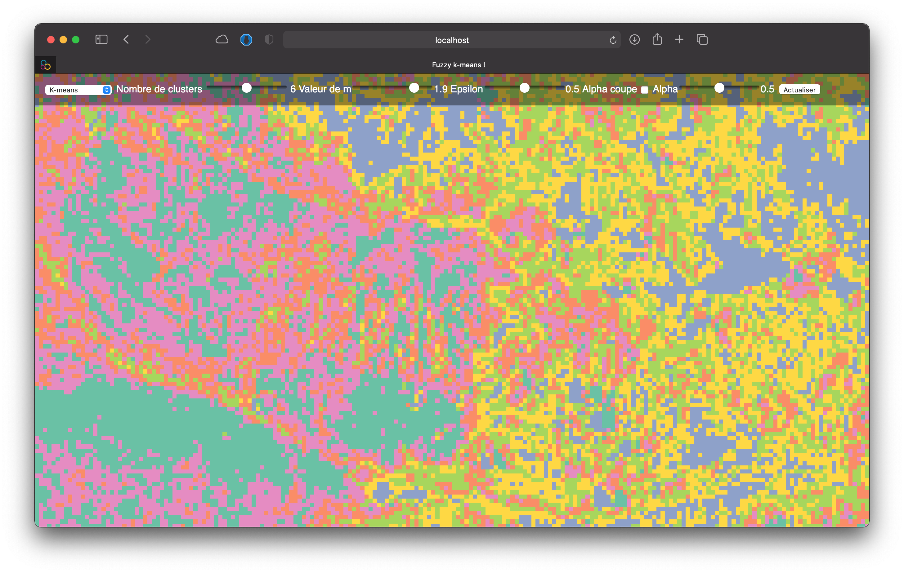

# i-FKM : Fuzzy K-Means for Interactive Satellite Image Segmentation

## Installation

Open terminal and paste the following lines to download the app and install the requirements:

```bash
git clone https://github.com/youakrim/i-FKM
cd i-FKM
pip install -r requirements.txt
```

## Launch the app

To launch the application make sure you're in the i-FKM directory and type:

```bash
python run.py
```

You can then access the web interface by opening http://localhost:8080/ in your web browser.



